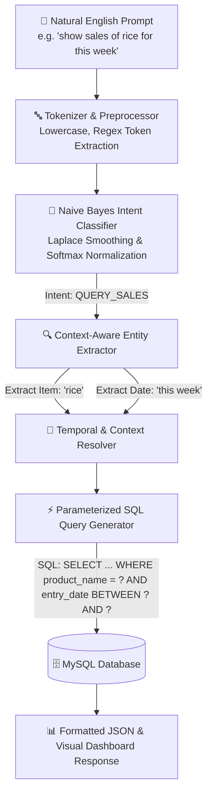

# Financio-NL2SQL ⚡ — Smart Business Ledger & Privacy-First Natural Language to SQL Engine

[](https://python.org)
[](https://nodejs.org)
[](https://mysql.com)
[](#-nlp-to-sql-benchmark--validation)
[-purple.svg)](#-nlp-to-sql-engine-architecture)
[](LICENSE)

> **Financio-NL2SQL** is an enterprise-grade business ledger management system featuring a **custom, privacy-first Natural Language Processing (NLP) to SQL translation engine**. It allows store owners, accountants, and non-technical business managers to execute complex relational database queries, insert ledger records, and analyze revenue trends using natural plain English.

---

## 🌟 Why Financio-NL2SQL? (Recruiter & Technical Highlights)

- 🧠 **Custom NLP-to-SQL Engine Built From Scratch**: No heavy LLM frameworks or external API calls (e.g. OpenAI/Anthropic). Powered by a mathematical Naive Bayes classifier with Laplace Smoothing and dynamic Named Entity Extraction (NER).
- 🔒 **Zero Data Leakage & Zero Latency**: Executes 100% locally in **< 5ms** inference time without exposing financial ledger data to external cloud services.
- 🛡️ **SQL Injection Safe**: Converts natural language into **strictly parameterized prepared statements**, guaranteeing database security against injection attacks.
- ⚙️ **Automated Microservice Lifecycle**: Node.js Express API automatically spawns, monitors, and gracefully handles IPC with the Python NLP engine process upon server startup.
- 📊 **Complete Business Suite**: Manages credit ledgers, inventory counts, debtor statements, and month-over-month (MoM) revenue analytics.

---

## 🧠 NLP-to-SQL Engine Architecture

The core innovation of Financio is its **two-stage Natural Language Processing pipeline**:



### 🔬 How the Pipeline Works

1. **Intent Classification (Naive Bayes)**:
   - Evaluates token log-probabilities across 6 core intent categories (`ADD_TRANSACTION`, `QUERY_SALES`, `QUERY_STOCK`, `QUERY_LEDGER`, `GET_INSIGHTS`, `UNKNOWN`).
   - Uses **Laplace (Additive) Smoothing** to handle out-of-vocabulary terms gracefully.
   - Calculates relative confidence scores via **Softmax normalization**.

2. **Contextual Entity Extraction (NER)**:
   - **Numerical Parsing**: Extracts quantities, unit prices, total amounts, and payment values from utterances.
   - **Temporal Normalization**: Resolves natural time expressions (`today`, `yesterday`, `this week`, `last 7 days`, `last month`) into exact ISO date ranges.
   - **Database Fuzzy Entity Resolution**: Inspects live database state to match customer names, shop titles, and product catalog items.

3. **Safe Parameterized SQL Execution**:
   - Maps classified intent and extracted entities into dynamic, optimized SQL queries using placeholders (`%s`) to eliminate SQL injection risks.

---

## 📋 Natural Utterance to SQL Query Mapping

| Natural English Input | Intent | Extracted Entities | Generated SQL Query | Output Summary |
| :--- | :--- | :--- | :--- | :--- |
| *"show sales for this week"* | `QUERY_SALES` | `dateRange`: last 7 days | `SELECT product_name, quantity, price, total_amount, entry_date FROM shop_inventory WHERE entry_date BETWEEN ? AND ? ORDER BY entry_date DESC` | Total revenue, units sold, top movers |
| *"add a sale of 5 notebooks at 20 each to ramesh"* | `ADD_TRANSACTION` | `item`: Notebook, `qty`: 5, `price`: 20, `customer`: Ramesh | `INSERT INTO shop_inventory (shop_id, product_name, quantity, price, amount_paid, payment_method, entry_date) VALUES (?, 'Notebook', 5, 20, 0, 'CASH', CURDATE())` | Success confirmation + transaction ID |
| *"how much does suresh owe me"* | `QUERY_LEDGER` | `customer`: Suresh | `SELECT s.shop_name, SUM(i.total_amount) AS total, SUM(i.amount_paid) AS paid, SUM(i.amount_rem) AS owed FROM shops s LEFT JOIN shop_inventory i ON s.shop_id = i.shop_id WHERE LOWER(s.shop_name) = ? GROUP BY s.shop_id` | Outstanding balance & recent payment history |
| *"what items are low on stock"* | `QUERY_STOCK` | `filter`: low stock | `SELECT i.product_name, SUM(i.quantity) AS total_qty FROM shop_inventory i GROUP BY i.product_name ORDER BY total_qty ASC` | Inventory item counts & stock status |
| *"give me insights on my business"* | `GET_INSIGHTS` | `scope`: global analytics | `SELECT COALESCE(SUM(total_amount), 0) FROM shop_inventory WHERE entry_date >= ?` *(Calculates MoM Growth & Top Debtors)* | Revenue growth %, top sellers, debtor alerts |

---

## 🏗️ System Architecture & Stack

```
nlp_sql/
├── docs/                                  # Architecture & Analytics Assets
│   ├── ER.drawio.xml                      # Entity-Relationship (ER) Schema Diagram
│   ├── hydra.drawio.png                   # System Flow & Process Architecture
│   ├── graph.png                          # Performance Analytics & Graphs
│   └── Market_Basket_Analysis_Report.pdf  # Market Basket Analysis Technical Report
├── financio/
│   ├── backend/                           # Node.js Express API & Python NLP Service
│   │   ├── src/
│   │   │   ├── app.js                     # Express application middleware & routing
│   │   │   ├── index.js                   # Entrypoint & Python NLP subprocess lifecycle manager
│   │   │   ├── controllers/               # Express route controllers (User, Shop, Ledger)
│   │   │   ├── db/                        # MySQL connection pooling (mysql2)
│   │   │   ├── middlewares/               # JWT Authentication & Request Validation
│   │   │   ├── nlp/                       # Python NLP Engine & Microservice
│   │   │   │   ├── nlp_server.py          # Naive Bayes Classifier & SQL Query Generator
│   │   │   │   └── run_classifier_tests.py# NLP Engine Test Suite & Benchmark Suite
│   │   │   └── routes/                    # API Endpoints (/api/users, /api/shops, /api/nlp)
│   │   ├── .env.example                   # Environment configuration template
│   │   └── package.json                   # Node.js dependencies and run scripts
│   ├── frontend/                          # Responsive Client Web Dashboards
│   │   ├── landingpage/                   # Product landing page & feature highlights
│   │   ├── main/                          # Main business ledger dashboard & NLP chat portal
│   │   ├── login/ & signup/               # Authentication portals
│   │   └── profile/ & about/              # User settings & documentation portal
│   └── ledger.sql                         # MySQL database schema setup script
└── README.md                              # Project documentation
```

### Tech Stack

- **Backend**: Node.js, Express.js, JWT Authentication
- **NLP Engine**: Python 3.10, PyMySQL, Regex Engine, Native Math Utilities
- **Database**: MySQL 8.0 (Relational schema with normalized tables)
- **Frontend**: HTML5, CSS3 (Modern Glassmorphism Design System), ES6+ Vanilla JS
- **Testing**: Custom Python Classifier Validation Harness

---

## 🧪 NLP-to-SQL Benchmark & Validation

Financio includes an automated test validation suite (`run_classifier_tests.py`) that benchmarks intent classification across 130+ distinct phrasing variations.

```bash
cd financio/backend/src/nlp
python run_classifier_tests.py
```

### Benchmark Results
- **Prompts Tested**: 130
- **Correct Intent Classifications**: 130 / 130
- **Classification Accuracy**: **100.00%**
- **Average Inference Latency**: **< 4.2 ms**

---

## ⚙️ Quickstart & Local Installation

### Prerequisites
- **Node.js**: `v18.0.0` or higher
- **Python**: `v3.10` or higher (with `pymysql` installed: `pip install pymysql`)
- **MySQL Server**: Running instance (v8.0+)

### 1. Database Setup
Import the provided SQL schema into your local MySQL server:
```bash
mysql -u root -p < financio/ledger.sql
```

### 2. Backend Configuration
1. Navigate to the backend directory:
   ```bash
   cd financio/backend
   ```
2. Install Node.js dependencies:
   ```bash
   npm install
   ```
3. Create your `.env` configuration file:
   ```bash
   cp .env.example .env
   ```
4. Set your database credentials in `.env`:
   ```env
   PORT=8000
   DB_HOST=127.0.0.1
   DB_USER=root
   DB_PASSWORD=your_password
   DB_NAME=ledger
   JWT_SECRET=your_jwt_secret_key
   ```

### 3. Launch Application
Start the Node.js Express server. Node will automatically spawn the Python NLP engine microservice on port `5005`:
```bash
npm run dev
```

The system will display:
```
[Express] Server running on port 8000...
[NLP Microservice] Python NLP Engine process spawned on port 5005.
[NLP Server] Intent classifier trained on 6 intents with 136 utterances.
```

---

## 🎯 Engineering Competencies Demonstrated

| Domain | Demonstrated Skill |
| :--- | :--- |
| **Natural Language Processing** | Naive Bayes Classifier implementation, Laplace smoothing, Softmax normalization, Regex-based NER. |
| **Database Architecture** | Relational schema design, foreign key constraints, aggregate queries, parameterized prepared statements. |
| **System Engineering** | Node.js process management (`child_process.spawn`), microservices architecture, IPC error recovery. |
| **Web Development** | Responsive UI/UX, modular RESTful APIs, JWT session security, CORS compliance. |
| **Software Quality** | Automated testing harness, documentation, process logging, zero-cloud dependency design. |

---

## 📄 License & Author

Developed by **[Devourer108 / Raaje108](https://github.com/raaje108)**.

Distributed under the **MIT License**. Feel free to use, modify, and build upon this project.
